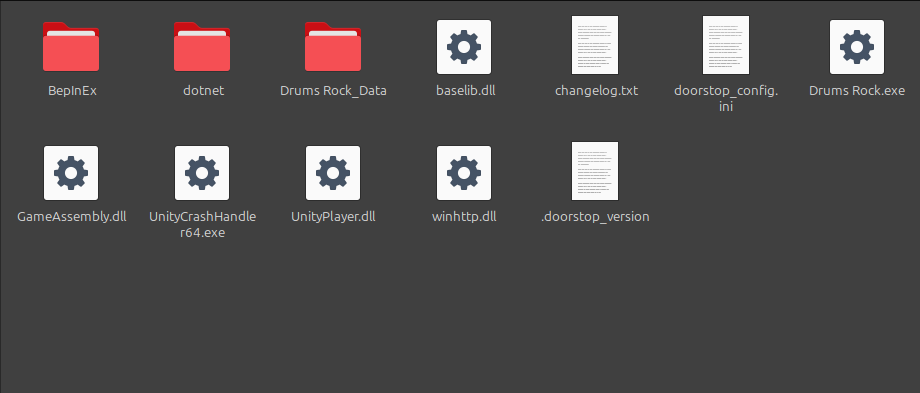
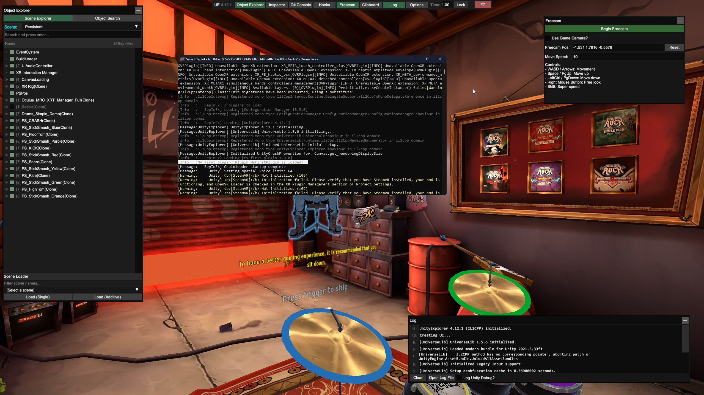
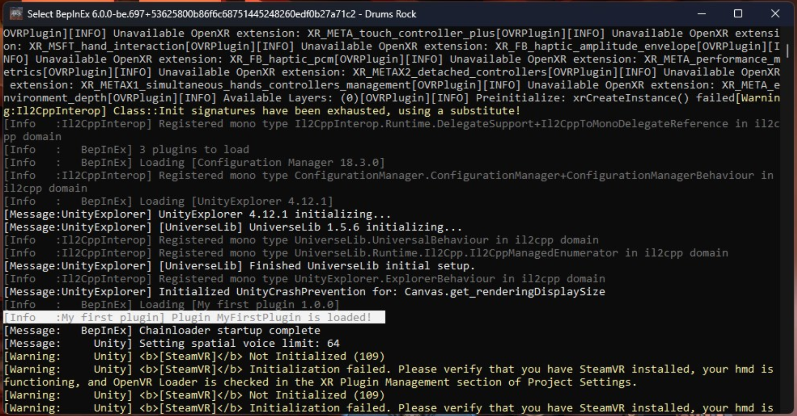

# Install BepInEx

BepInEx is a "framework" for modding Unity Games. Drums Rock is a Unity game using `Il2CppInterop`, a bit new for BepInEx, but it works.

Grab yourself a release from the [BepInEx GitHub Repository](https://github.com/BepInEx/BepInEx) [(I used `v6.0.0-pre.2`)](https://github.com/BepInEx/BepInEx/releases/tag/v6.0.0-pre.2) and extract it in the root of the game folder.

Now run the game, and if all goes well, you should see a console pop up, and in a matter of seconds the game will start. Now you've generated all the config files needed for BepInEx to work.

## Installing some plugins

My knowledge on C# is very limited, so I won't be able to help you much with creating plugins. But I can help you install some to see how it works.

### UnityExplorer

UnityExplorer is a tool that allows you to explore the game's objects and components. It's very useful for finding the names of the objects you want to interact with. If you want to get into modding, this is a must-have.

Grab the latest release from the [UnityExplorer GitHub Repository](https://github.com/yukieiji/UnityExplorer), and extract it in the `BepInEx/plugins` folder, that's located in the game folder.

Now open the game, and in a few seconds the plugin should show up automatically. If not, try pressing `F9`.

## Creating a plugin

Creating a plugin is very straightforward. You can follow BepInEx's guide on [Writing a basic plugin](https://docs.bepinex.dev/master/articles/dev_guide/plugin_tutorial/index.html).

I've created a simple plugin that just outputs something in the console.

